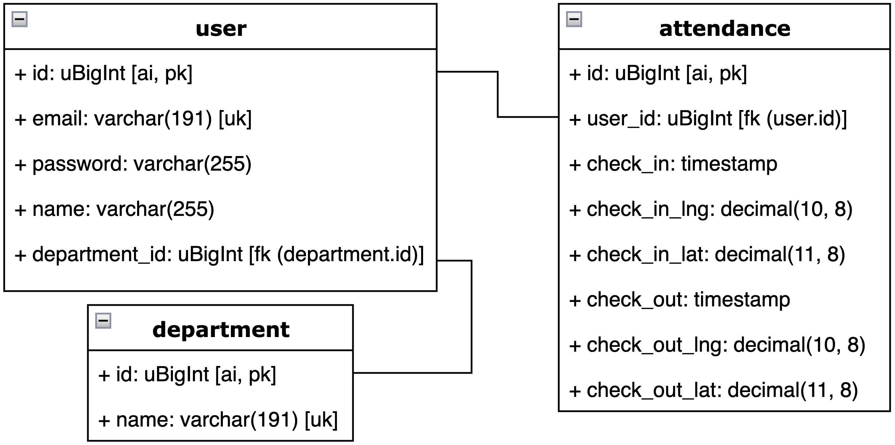

# Soal 3 - Web Service
Buatlah sebuah program `Web Service` dengan ketentuan sebagai berikut:

## 1. Database
Buatlah sebuah database dengan design sebagai berikut:
<br>

<br>
untuk database bisa menggunakan MySQL, Postgres, atau MS SQL Server. Export database yang telah dibuat dengan format `.sql` dan push pada direktori ini.
<br><br>

## 2. API
## 2.1 Authentication
Authentication menggunakan JWT
<br><br>

### 2.1.1 Register
#### Request
<table>
    <tbody>
        <tr>
            <td>url</td>
            <td>{{base_url}}/register</td>
        </tr>
        <tr>
            <td>method</td>
            <td>POST</td>
        </tr>
    </tbody>
</table>

```json
{
    "email": "admin@mail.com",
    "passowrd": "admin",
    "name": "Admin",
    "department_id": 1,
}
```

#### Response
```json
{
    "message": "register success",
    "token": "generated_token"
}
```

<br>

### 2.1.2 Login
#### Request
<table>
    <tbody>
        <tr>
            <td>url</td>
            <td>{{base_url}}/login</td>
        </tr>
        <tr>
            <td>method</td>
            <td>POST</td>
        </tr>
    </tbody>
</table>

```json
{
    "email": "admin@mail.com",
    "passowrd": "admin"
}
```
#### Response
```json
{
    "message": "login success",
    "token": "generated_token"
}
```

<br>

## 2.2 Department
### 2.2.1 Read
<table>
    <tbody>
        <tr>
            <td>url</td>
            <td>{{base_url}}/department</td>
        </tr>
        <tr>
            <td>method</td>
            <td>GET</td>
        </tr>
    </tbody>
</table>

#### Response
```json
{
    "departments": [
        {
            "id": 1,
            "name": "Human Resource"
        },{
            "id": 2,
            "name": "Finance"
        }
    ]
}
```

<br>

### 2.2.2 Show
<table>
    <tbody>
        <tr>
            <td>url</td>
            <td>{{base_url}}/department/{id}</td>
        </tr>
        <tr>
            <td>method</td>
            <td>GET</td>
        </tr>
    </tbody>
</table>

#### Request
```
{{base_url}}/department/2
```
#### Response
```json
{
    "department": {
        "id": 2,
        "name": "Finance"
    }
}
```

<br>

### 2.2.3 Insert
<table>
    <tbody>
        <tr>
            <td>url</td>
            <td>{{base_url}}/department</td>
        </tr>
        <tr>
            <td>method</td>
            <td>POST</td>
        </tr>
    </tbody>
</table>

#### Request
```json
{
    "name": "IT Dev"
}
```
#### Response
```json
{
    "message": "success add department",
    "department": {
        "id": 3,
        "name": "IT Dev"
    }
}
```

### 2.2.4 Update
<table>
    <tbody>
        <tr>
            <td>url</td>
            <td>{{base_url}}/department/{id}</td>
        </tr>
        <tr>
            <td>method</td>
            <td>PUT</td>
        </tr>
    </tbody>
</table>

#### Request
```
{{base_url}}/department/3
```
```json
{
    "name": "IT Development"
}
```
#### Response
```json
{
    "message": "success update department",
    "department": {
        "id": 3,
        "name": "IT Development"
    }
}
```

<br>

### 2.2.5 Delete
<table>
    <tbody>
        <tr>
            <td>url</td>
            <td>{{base_url}}/department/{id}</td>
        </tr>
        <tr>
            <td>method</td>
            <td>DELETE</td>
        </tr>
    </tbody>
</table>

#### Request
```
{{base_url}}/department/3
```
#### Response
```json
{
    "message": "success delete IT Development",
}
```
<br>

## 2.3 Attendance
### 2.3.1 Check In
#### Request
<table>
    <tbody>
        <tr>
            <td>url</td>
            <td>{{base_url}}/check_in</td>
        </tr>
        <tr>
            <td>method</td>
            <td>POST</td>
        </tr>
        <tr>
            <td>Header</td>
            <td>Authorization Bearer token_generated</td>
        </tr>
    </tbody>
</table>

```json
{
    "lng": -6.2273292,
    "lat": 106.8208827
}
```

#### Reponse
```json
{
    "message": "check in success"
}
```

<br>

### 2.3.2 Check Out
#### Request
<table>
    <tbody>
        <tr>
            <td>url</td>
            <td>{{base_url}}/check_out</td>
        </tr>
        <tr>
            <td>method</td>
            <td>POST</td>
        </tr>
        <tr>
            <td>Header</td>
            <td>Authorization Bearer token_generated</td>
        </tr>
    </tbody>
</table>

```json
{
    "lng": -6.2273292,
    "lat": 106.8208827
}
```

#### Reponse
```json
{
    "message": "check out success"
}
```

<br>

### 2.3.3 My Attendance
#### Request
<table>
    <tbody>
        <tr>
            <td>url</td>
            <td>{{base_url}}/my_attendance</td>
        </tr>
        <tr>
            <td>method</td>
            <td>GET</td>
        </tr>
        <tr>
            <td>Header</td>
            <td>Authorization Bearer token_generated</td>
        </tr>
    </tbody>
</table>

```json
{
    "check_in_start": "2022-08-01",
    "check_in_end": "2022-08-02"
}
```

#### Reponse
```json
{
    "attendances": [
        {
            "id": 1,
            "check_in": "2022-08-01 08:00:00",
            "check_in_lng": -6.2273292,
            "check_in_lat": 106.8208827,
            "check_out": "2022-08-01 17:00:00",
            "check_out_lng": -6.2273292,
            "check_out_lat": 106.8208827
        },
        {
            "id": 3,
            "check_in": "2022-08-02 08:00:00",
            "check_in_lng": -6.2273292,
            "check_in_lat": 106.8208827,
            "check_out": "2022-08-02 17:00:00",
            "check_out_lng": -6.2273292,
            "check_out_lat": 106.8208827
        }
    ]
}
```

<br>

## 2.4 Report by Department
#### Request
<table>
    <tbody>
        <tr>
            <td>url</td>
            <td>{{base_url}}/report_department</td>
        </tr>
        <tr>
            <td>method</td>
            <td>GET</td>
        </tr>
        <tr>
            <td>Header</td>
            <td>Authorization Bearer token_generated</td>
        </tr>
    </tbody>
</table>

```json
{
    "check_in_start": "2022-08-01",
    "check_in_end": "2022-08-02",
    "department_id": 1
}
```

#### Reponse
```json
{
    "attendances": [
        {
            "id": 1,
            "user_id": 1,
            "name": "Admin",
            "check_in": "2022-08-01 08:00:00",
            "check_in_lng": -6.2273292,
            "check_in_lat": 106.8208827,
            "check_out": "2022-08-01 17:00:00",
            "check_out_lng": -6.2273292,
            "check_out_lat": 106.8208827
        },
        {
            "id": 2,
            "user_id": 2,
            "name": "Mimin",
            "check_in": "2022-08-02 08:00:00",
            "check_in_lng": -6.2273292,
            "check_in_lat": 106.8208827,
            "check_out": "2022-08-02 17:00:00",
            "check_out_lng": -6.2273292,
            "check_out_lat": 106.8208827
        },
        {
            "id": 3,
            "user_id": 1,
            "name": "Admin",
            "check_in": "2022-08-02 08:00:00",
            "check_in_lng": -6.2273292,
            "check_in_lat": 106.8208827,
            "check_out": "2022-08-02 17:00:00",
            "check_out_lng": -6.2273292,
            "check_out_lat": 106.8208827
        },
        {
            "id": 4,
            "user_id": 2,
            "name": "Mimin",
            "check_in": "2022-08-02 08:00:00",
            "check_in_lng": -6.2273292,
            "check_in_lat": 106.8208827,
            "check_out": "2022-08-02 17:00:00",
            "check_out_lng": -6.2273292,
            "check_out_lat": 106.8208827
        }
    ]
}
```